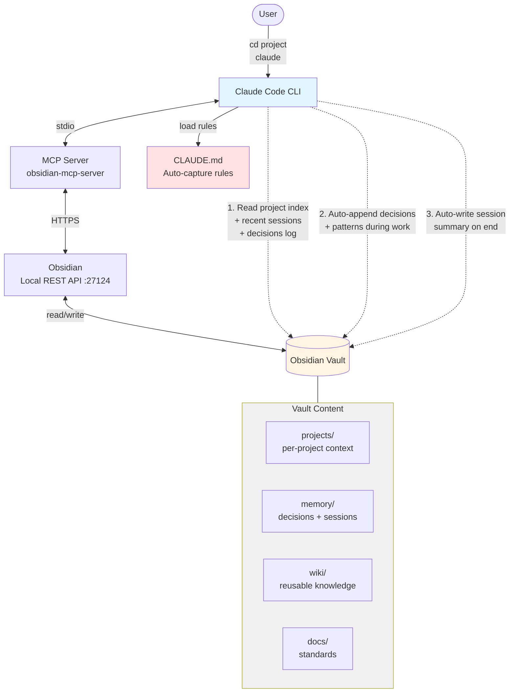

# TechLa Knowledge Vault

Obsidian vault làm knowledge base cho Claude Code — lưu decisions, docs, wiki, session memory xuyên suốt các dự án.

## Sơ đồ hoạt động



**Luồng xử lý:**

1. **Session start** — User `cd` vào project → chạy `claude` → Claude Code load `CLAUDE.md` → qua MCP đọc `projects/<name>/_index.md` + 3 sessions gần nhất + `decisions-log.md`
2. **Working** — User code/chat bình thường → Claude tự append decisions vào `memory/decisions-log.md`, tự tạo wiki articles khi gặp pattern mới
3. **Session end** — Claude tự viết `memory/sessions/YYYY-MM-DD-<slug>.md` gồm tasks completed, decisions, blockers

## Setup

### Quick setup (recommended)

```bash
git clone https://github.com/techlaaidev/claude-obsidian.git
cd claude-obsidian
claude
```

Trong Claude Code, gõ: **"Setup vault theo SETUP.md"**

Claude sẽ tự động:
- Detect vault path
- Tạo `.mcp.json` sau khi bạn paste API key
- Update `~/.claude/CLAUDE.md` với auto-capture rules
- Verify MCP connection

Và sẽ hỏi bạn 3 bước manual: cài Obsidian, cài plugins, copy API key.

Chi tiết xem [`SETUP.md`](./SETUP.md).

---

### Manual setup

Nếu bạn muốn làm tay từng bước:

### 1. Clone repo

```bash
git clone https://github.com/techlaaidev/claude-obsidian.git
cd claude-obsidian
```

### 2. Cài Obsidian + Plugins

1. Tải [Obsidian](https://obsidian.md/download) → Open folder as vault → chọn thư mục vừa clone
2. Settings → Community Plugins → Turn on → Browse, cài:
   - **Local REST API** (bắt buộc cho MCP)
   - **Dataview** (query frontmatter)
   - **Templater** (template nâng cao)
3. Enable từng plugin sau khi cài

### 3. Cấu hình Local REST API

1. Settings → Local REST API
2. Copy **API Key**
3. Lưu ý **port** (mặc định `27124` cho HTTPS)

### 4. Register MCP cho Claude Code (user scope)

Đăng ký ở **user scope** để MCP hoạt động từ mọi CWD:

```bash
claude mcp add-json --scope user obsidian '{"command":"npx","args":["-y","obsidian-mcp-server"],"env":{"OBSIDIAN_API_KEY":"<paste-key-o-day>","OBSIDIAN_BASE_URL":"https://127.0.0.1:27124","OBSIDIAN_VERIFY_SSL":"false"}}'
```

**Lưu ý env vars:**
- `OBSIDIAN_BASE_URL` (không phải `OBSIDIAN_API_URL`)
- `OBSIDIAN_VERIFY_SSL=false` — tắt verify SSL do plugin dùng self-signed cert

Verify: `claude mcp list` → phải thấy `obsidian: ... ✓ Connected`

Restart Claude Code session để MCP tools load vào context.

## Cấu trúc

```
├── CLAUDE.md         # System prompt — Claude đọc đầu mỗi session
├── docs/             # Standards, architecture, guides
├── projects/         # Docs per-project (mỗi dự án 1 folder)
├── wiki/             # Knowledge tái sử dụng (concepts, tech, patterns)
├── memory/           # Session logs, decisions-log.md
├── templates/        # 4 templates (session, decision, project, wiki)
├── raw/              # Research notes
└── plans/            # Implementation plans
```

## Cách dùng

### Workflow hằng ngày (zero-friction)

```bash
# 1. Mở Obsidian (để MCP Local REST API hoạt động)
# 2. cd vào BẤT KỲ project nào của bạn
cd D:/projects/my-app

# 3. Chạy claude
claude

# 4. Code / chat bình thường
```

**Claude tự động làm những việc sau** (nhờ auto-capture rules trong `~/.claude/CLAUDE.md`):

| Khi nào | Claude tự làm |
|---------|---------------|
| Session start | Đọc `projects/my-app/_index.md` + 3 session gần nhất + `decisions-log.md` từ vault |
| Project mới | Tự tạo `projects/my-app/_index.md` nếu chưa có |
| Ra quyết định kỹ thuật | Append vào `memory/decisions-log.md` |
| Gặp pattern tái sử dụng | Tạo note trong `wiki/<category>/` |
| Session end | Viết `memory/sessions/YYYY-MM-DD-<slug>.md` (tasks, decisions, blockers) |

**Project name** = tên folder bạn đang `cd` vào (CWD basename).

### Bạn KHÔNG cần

- ❌ Update Active Context thủ công
- ❌ Chạy template thủ công
- ❌ Ghi decision thủ công
- ❌ Tạo project folder thủ công

### Khi nào cần can thiệp thủ công

- **Tắt auto-capture cho session cụ thể:** nói với Claude *"Đừng log session này"*
- **Archive project cũ:** đổi `status: active` → `status: archived` trong `projects/<name>/_index.md`
- **Xem lại history:** mở Obsidian, browse `memory/sessions/` hoặc `memory/decisions-log.md`

### Quy tắc

- File atomic — 1 concept/file
- Dùng `[[wiki links]]` thay vì folder hierarchy sâu
- Frontmatter bắt buộc: `tags`, `status`, `created`
- **Không** commit secrets — `.mcp.json` đã trong `.gitignore`
- **Không** xóa decisions cũ — mark `status: deprecated` nếu cần

## Troubleshooting

| Lỗi | Fix |
|-----|-----|
| `claude mcp list` báo `✗ Failed to connect` | Check env vars: phải là `OBSIDIAN_BASE_URL` (không `OBSIDIAN_API_URL`), thêm `OBSIDIAN_VERIFY_SSL=false` |
| `curl` trả về 000 | Obsidian chưa mở hoặc plugin Local REST API chưa enable |
| `curl` trả về 401 | API key sai — copy lại từ plugin settings |
| Port khác 27124 | Sửa `OBSIDIAN_BASE_URL` port cho khớp |
| MCP connect OK nhưng Claude không thấy tools | Restart Claude Code session |

**Re-register MCP sau khi fix:**
```bash
claude mcp remove --scope user obsidian
claude mcp add-json --scope user obsidian '<new-json>'
```

Chi tiết MCP: xem `docs/mcp-setup-guide.md`.

## Contributing & Feedback

Repo public, mọi người có thể:

- **Báo lỗi / đề xuất feature:** tạo issue tại [Issues](https://github.com/techlaaidev/claude-obsidian/issues)
- **Đóng góp code/docs:** fork repo → tạo branch → submit Pull Request
- **Hỏi đáp:** mở issue với label `question`

Khi báo lỗi, include:
- OS + Obsidian version + Claude Code version
- Bước reproduce
- Log lỗi (nếu có)

## License

MIT (hoặc chỉ định license phù hợp — cập nhật sau).
